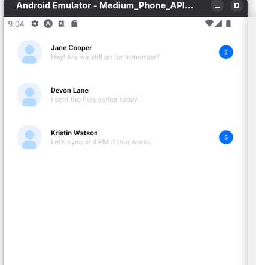
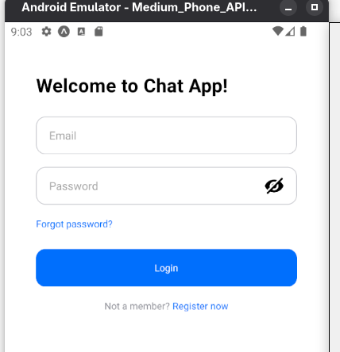
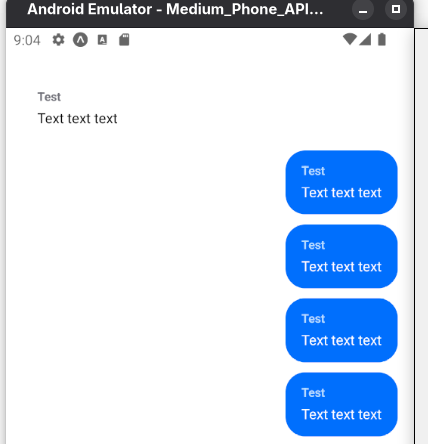
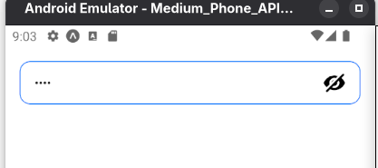
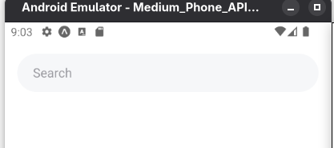
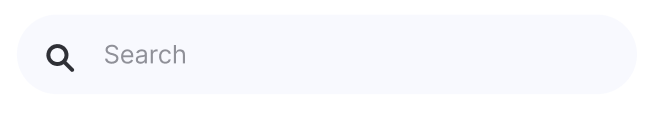
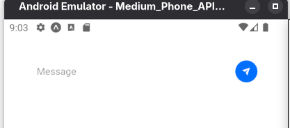

# GoIT Mobile Design 6

## Scripts

```sh
npm run storybook
npm run ios
npm run android
```

## Screenshots

<table>
  <tr>
    <th align="center">Chat List</th>
  </tr>
  <tr>
    <td align="center"></td>
  </tr>
  <tr>
    <th align="center">Email Field</th>
  </tr>
  <tr>
    <td align="center"></td>
  </tr>
  <tr>
    <th align="center">Login Form</th>
  </tr>
  <tr>
    <td align="center"></td>
  </tr>
  <tr>
    <th align="center">Messages List</th>
  </tr>
  <tr>
    <td align="center"></td>
  </tr>
  <tr>
    <th align="center">Password Field</th>
  </tr>
  <tr>
    <td align="center"></td>
  </tr>
  <tr>
    <th align="center">Search Field</th>
  </tr>
  <tr>
    <td align="center"></td>
  </tr>
  <tr>
    <th align="center">Search Form</th>
  </tr>
  <tr>
    <td align="center"></td>
  </tr>
  <tr>
    <th align="center">Send Message Form</th>
  </tr>
  <tr>
    <td align="center"></td>
  </tr>
</table>
